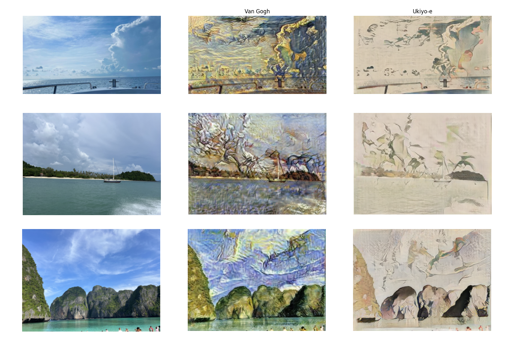

# Animator

Implementation of various image/video translation and segmentation algorithms. The distributed training pipeline utilizes the DistributedDataParallel package and is trained on the remote platform Yandex DataSphere Jobs.

Project under development.

## Intermediate results

Image/video translation results were obtained based on Cycle LSGAN architecture for two artistic styles Van Gogh and Ukiyo-e.

<video src="https://github.com/user-attachments/assets/1a3ca1fd-7800-4a6e-834b-f0cb23404b20"></video>

## Main scheduled improvements

1. Implementation of one-step diffusion model CycleGan-Turbo for transition quality improvement.
2. Modifications to the model to enable smooth video transitions.
    
    Illustration of flaws for current transforming videos frame by frame approach.
    <video src="https://github.com/user-attachments/assets/8b7ed24f-a43b-4e3d-b95f-31ab8a3d9db8"></video>

## Useful links

1. [Unpaired Image-to-Image Translation using Cycle-Consistent Adversarial Networks](https://arxiv.org/abs/1703.10593)
2. [One-Step Image Translation with Text-to-Image Models](https://arxiv.org/abs/2403.12036)
3. [Image-to-Image Translation with Conditional Adversarial Networks](https://arxiv.org/abs/1611.07004)
4. [Least Squares Generative Adversarial Networks](https://openaccess.thecvf.com/content_ICCV_2017/papers/Mao_Least_Squares_Generative_ICCV_2017_paper.pdf)
5. [Adding Conditional Control to Text-to-Image Diffusion Models](https://arxiv.org/abs/2302.05543)
6. [Improved Denoising Diffusion Probabilistic Models](https://arxiv.org/abs/2102.09672)
7. [Denoising Diffusion Probabilistic Models](https://arxiv.org/abs/2006.11239)
